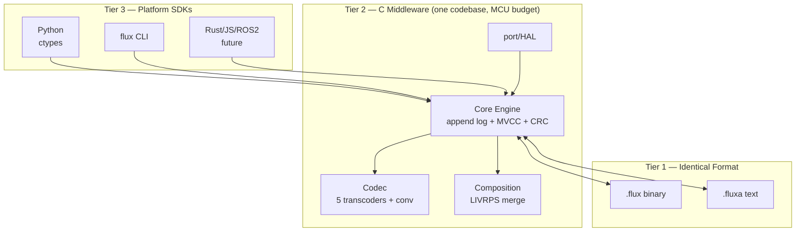
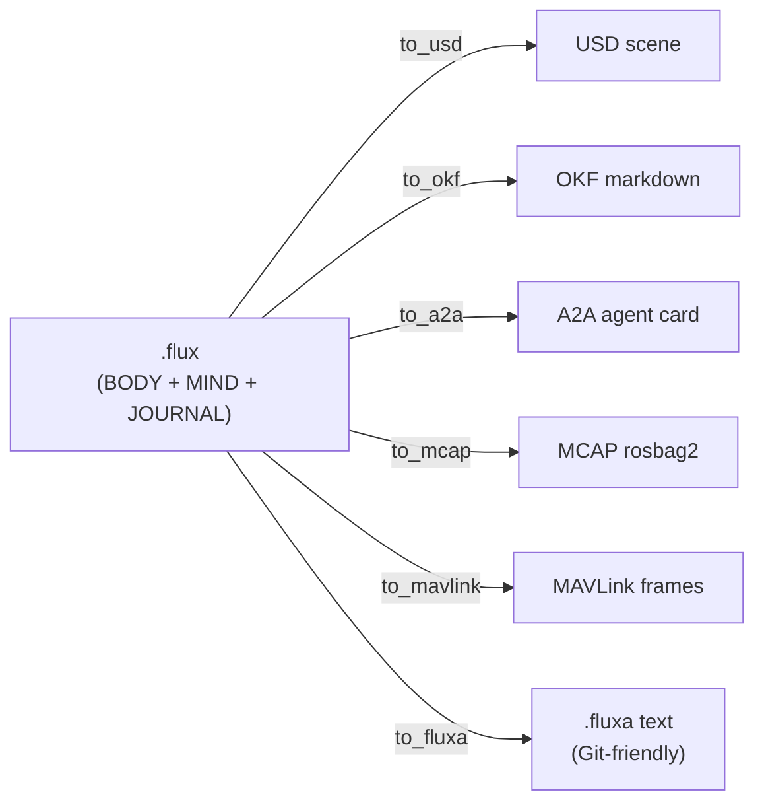
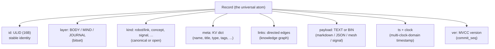
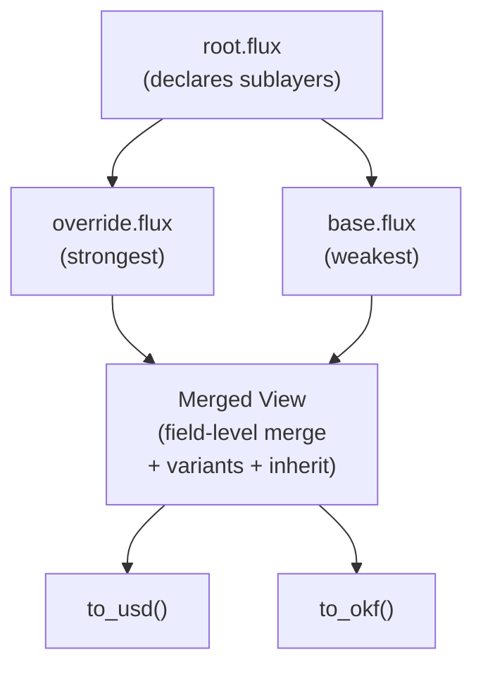
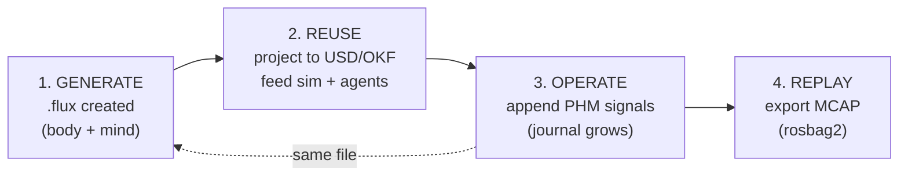
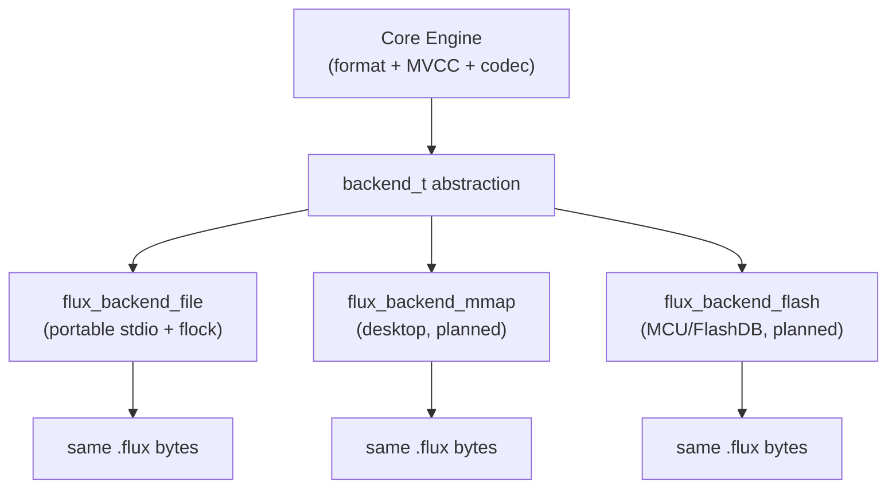

# Architecture

FLUXmeme is a **self-describing asset format for embodied nodes**: one `.flux` =
one robot = **body (BODY) + mind (MIND) + lifetime journal (JOURNAL)**. See
[SPEC.md](../SPEC.md) for the design rationale.

## Three tiers

The **format is invariant**; platform differences are absorbed entirely by
Tier 2/3. Tier 2 is a single pure-C codebase; its complexity budget is "runs on
a Cortex-M7 (FLUXLOOP/STM32H7)".

## One source, many projections

FLUXmeme doesn't "contain" a USD file — it *is* the asset and renders a view on
demand. Your tools keep working; FLUXmeme is the single source behind them.

## Record structure

Adding a new domain is a new `kind`, never an engine change.

## Composition (LIVRPS)

Composition is **read-time, non-destructive**. Stronger layers override field by
field; weaker layers fill gaps. The original files are never modified.

## Lifecycle (DevReady)

One `.flux` through the full lifecycle. The journal grows on-device (MCU); the
body + mind stay constant. **Born in reality, perpetually real.**

## Backends

Same bytes across all backends. A `.flux` written on a cloud GPU is read
unchanged on a Cortex-M7.
